# DevOps & Cloud Engineering Mastery Notes
*Complete foundational guide for the Auto-Pipe project*

---

## Table of Contents

1. [Fundamental Concepts](#1-fundamental-concepts)
2. [Application Architecture](#2-application-architecture)
3. [Containerization Deep Dive](#3-containerization-deep-dive)
4. [CI/CD Pipeline Concepts](#4-cicd-pipeline-concepts)
5. [AWS Cloud Services](#5-aws-cloud-services)
6. [Security & IAM](#6-security--iam)
7. [Monitoring & Observability](#7-monitoring--observability)
8. [Infrastructure as Code](#8-infrastructure-as-code)
9. [Interview Questions & Answers](#9-interview-questions--answers)

---

## 1. Fundamental Concepts

### What is DevOps?

**DevOps** is a cultural and technical movement that bridges Development (Dev) and Operations (Ops) teams to deliver software faster, more reliably, and with higher quality.

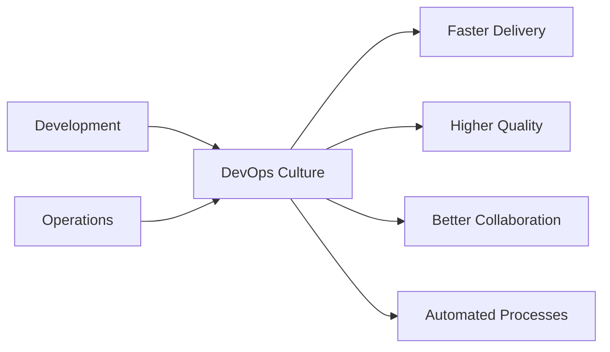

#### Core DevOps Principles:
1. **Collaboration**: Breaking down silos between teams
2. **Automation**: Reducing manual, error-prone processes
3. **Continuous Integration**: Frequent code integration
4. **Continuous Delivery**: Automated deployment pipeline
5. **Monitoring**: Real-time visibility into systems
6. **Feedback**: Quick feedback loops for improvement

### Cloud Computing Fundamentals

**Cloud Computing** provides on-demand access to computing resources over the internet.

#### Service Models:
- **IaaS** (Infrastructure as a Service): Virtual machines, storage, networks
- **PaaS** (Platform as a Service): Application platforms, databases
- **SaaS** (Software as a Service): Complete applications

#### Deployment Models:
- **Public Cloud**: AWS, Azure, GCP
- **Private Cloud**: On-premises cloud infrastructure
- **Hybrid Cloud**: Combination of public and private

---

## 2. Application Architecture

### Microservices vs Monolith

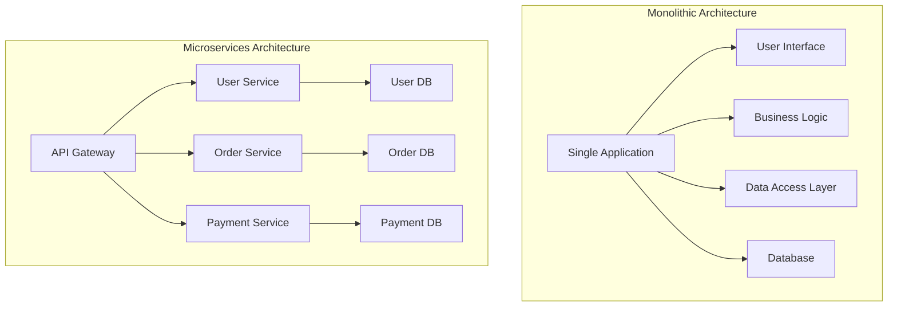

#### Our Project Architecture:
- **Single Service**: FastAPI application (microservice approach)
- **Stateless**: No server-side session storage
- **API-First**: RESTful API design
- **Health Checks**: Built-in monitoring endpoints

### REST API Design Principles

#### HTTP Methods:
- **GET**: Retrieve data (idempotent, safe)
- **POST**: Create new resources
- **PUT**: Update entire resource (idempotent)
- **PATCH**: Partial update
- **DELETE**: Remove resource (idempotent)

#### Status Codes:
- **2xx**: Success (200 OK, 201 Created, 204 No Content)
- **4xx**: Client errors (400 Bad Request, 401 Unauthorized, 404 Not Found)
- **5xx**: Server errors (500 Internal Server Error, 502 Bad Gateway)

### FastAPI Deep Dive

**FastAPI** is a modern Python web framework for building APIs with automatic documentation and type safety.

#### Key Features:
1. **Type Hints**: Automatic validation and documentation
2. **Async Support**: High performance with async/await
3. **Automatic Docs**: OpenAPI/Swagger integration
4. **Dependency Injection**: Clean, testable code architecture

#### Code Example Analysis:
```python
# Type safety with Pydantic
class Item(BaseModel):
    id: int
    name: str
    description: str = "A sample item"

# Async endpoint for better performance
@app.get("/items/{item_id}", response_model=Item)
async def read_item(item_id: int):
    # Automatic validation of item_id as integer
    return Item(id=item_id, name=f"item-{item_id}")
```

---

## 3. Containerization Deep Dive

### What are Containers?

**Containers** package applications with all their dependencies into a lightweight, portable unit.

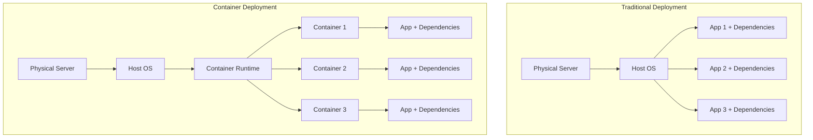

### Docker Architecture

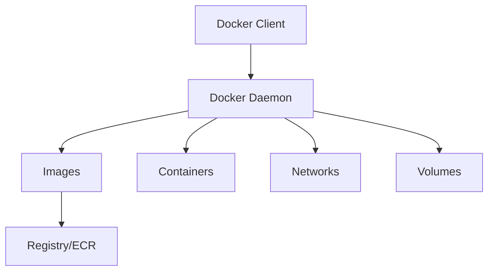

#### Key Docker Concepts:

1. **Image**: Read-only template for creating containers
2. **Container**: Running instance of an image
3. **Dockerfile**: Instructions to build an image
4. **Registry**: Storage for images (Docker Hub, ECR)
5. **Volume**: Persistent data storage
6. **Network**: Container communication

### Multi-Stage Docker Builds

Our Dockerfile uses multi-stage builds for optimization:

```dockerfile
# Stage 1: Base image with dependencies
FROM python:3.11-slim as base
WORKDIR /app
COPY requirements.txt .
RUN pip install -r requirements.txt

# Stage 2: Application layer
COPY ./app ./app
# Final optimized image
```

#### Benefits:
- **Smaller Images**: Only production dependencies
- **Security**: Reduced attack surface
- **Caching**: Better layer caching
- **Separation**: Build vs runtime environments

### Docker Compose Concepts

**Docker Compose** defines multi-container applications using YAML.

#### Our compose.yml Analysis:
```yaml
services:
  web:
    build: .                    # Build from Dockerfile
    ports:
      - "8000:80"              # Port mapping
    environment:               # Environment variables
      - ENV=development
    volumes:                   # Mount source code
      - ./app:/app/app:ro
    healthcheck:               # Container health monitoring
      test: ["CMD", "curl", "-f", "http://localhost:80/health"]
```

---

## 4. CI/CD Pipeline Concepts

### Continuous Integration (CI)

**CI** automatically integrates code changes from multiple developers.

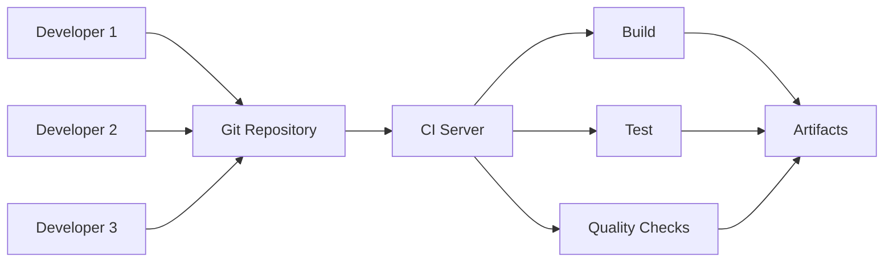

#### CI Benefits:
- **Early Bug Detection**: Issues found quickly
- **Reduced Integration Problems**: Frequent small changes
- **Automated Testing**: Consistent test execution
- **Code Quality**: Automated linting and formatting

### Continuous Deployment (CD)

**CD** automatically deploys code changes to production.

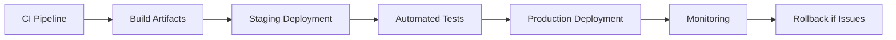

### GitHub Actions Deep Dive

**GitHub Actions** provides CI/CD as code using YAML workflows.

#### Workflow Structure:
```yaml
name: CI/CD Pipeline                 # Workflow name
on: [push, pull_request]            # Triggers
jobs:                               # Parallel jobs
  test:                             # Job name
    runs-on: ubuntu-latest          # Runner environment
    steps:                          # Sequential steps
      - uses: actions/checkout@v4   # Reusable action
      - run: pytest tests/          # Shell command
```

#### Our Pipeline Stages:

1. **Test Stage**:
   - Code checkout
   - Python environment setup
   - Dependency installation
   - Linting (flake8, black)
   - Unit tests (pytest)

2. **Build & Push Stage**:
   - Docker image build
   - Multi-architecture support
   - ECR authentication
   - Image vulnerability scanning
   - Push to registry

3. **Deploy Stage**:
   - ECS task definition update
   - Service deployment
   - Health check validation
   - Rollback on failure

4. **Notification Stage**:
   - Slack notifications
   - Status reporting

### Security in CI/CD

#### OIDC (OpenID Connect) Authentication:
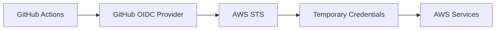

**Benefits of OIDC**:
- No long-lived credentials in GitHub
- Automatic credential rotation
- Fine-grained permissions
- Audit trail

---

## 5. AWS Cloud Services

### Amazon ECR (Elastic Container Registry)

**ECR** is AWS's managed Docker registry service.

#### Features:
- **Private Repositories**: Secure image storage
- **Image Scanning**: Vulnerability detection
- **Lifecycle Policies**: Automated cleanup
- **IAM Integration**: Fine-grained access control

### Amazon ECS (Elastic Container Service)

**ECS** orchestrates Docker containers on AWS.

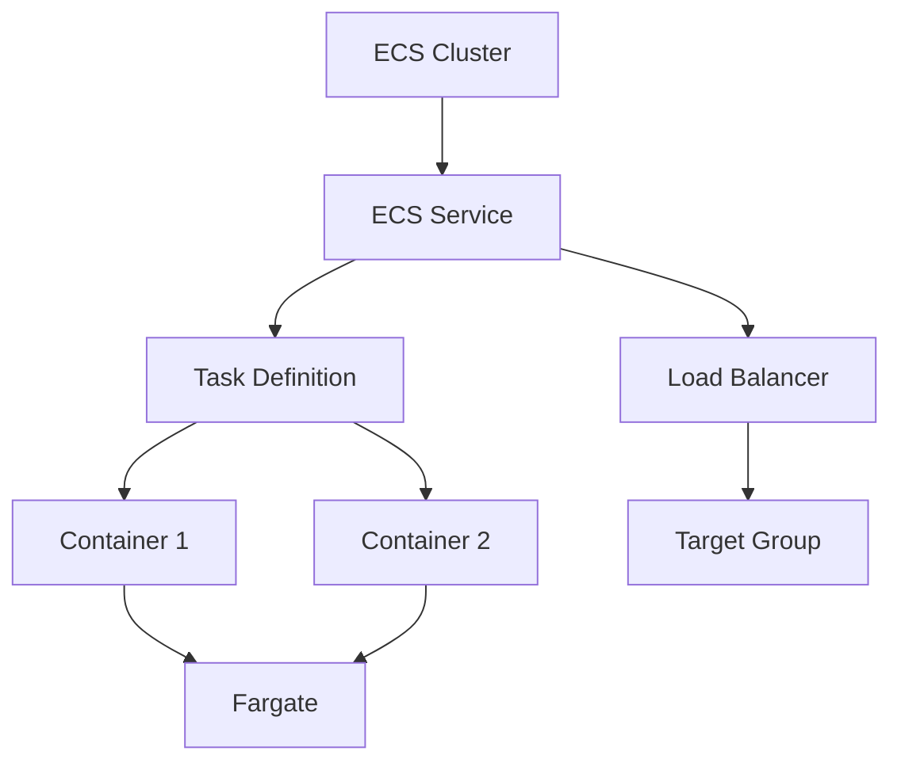

#### Key Concepts:

1. **Cluster**: Logical grouping of compute resources
2. **Service**: Maintains desired number of running tasks
3. **Task Definition**: Blueprint for running containers
4. **Task**: Running instance of task definition
5. **Fargate**: Serverless compute for containers

#### ECS vs EKS vs EC2:

| Service | Use Case | Management | Cost |
|---------|----------|------------|------|
| ECS | Simple container orchestration | AWS managed | Lower |
| EKS | Kubernetes workloads | Kubernetes API | Higher |
| EC2 | Custom container runtime | Self-managed | Variable |

### AWS Fargate Deep Dive

**Fargate** provides serverless compute for containers.

#### Benefits:
- **No Server Management**: AWS handles infrastructure
- **Pay-per-use**: Only pay for running containers
- **Security**: Isolated compute environments
- **Scaling**: Automatic scaling based on demand

#### Resource Allocation:
```json
{
  "cpu": "256",        // 0.25 vCPU
  "memory": "512",     // 512 MB RAM
  "networkMode": "awsvpc"  // Dedicated ENI
}
```

### CloudWatch Services

**CloudWatch** provides monitoring and observability.

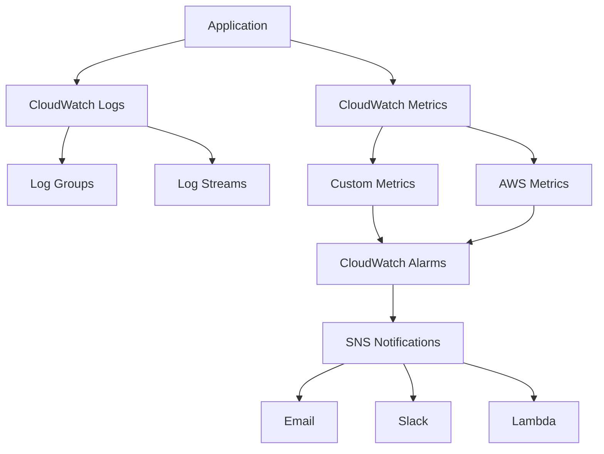

#### Components:
1. **Logs**: Centralized log collection and analysis
2. **Metrics**: Performance data collection
3. **Alarms**: Automated alerting based on thresholds
4. **Dashboards**: Visual monitoring interfaces

---

## 6. Security & IAM

### AWS Identity and Access Management (IAM)

**IAM** controls access to AWS resources.

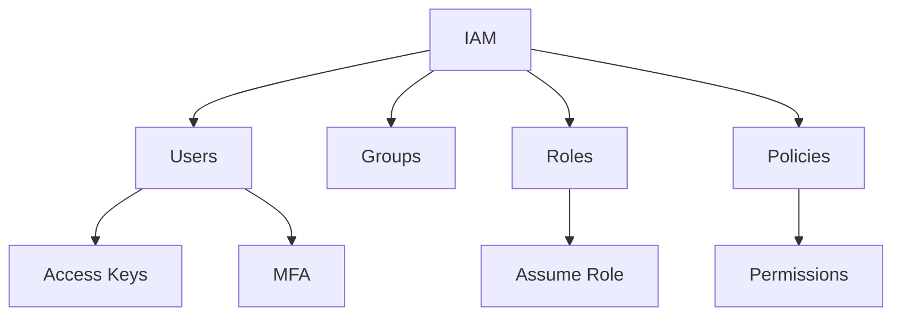

#### Core Concepts:

1. **Users**: Individual AWS accounts
2. **Groups**: Collections of users
3. **Roles**: Temporary access for services/applications
4. **Policies**: JSON documents defining permissions
5. **Principal**: Entity that can make requests

### Security Best Practices

#### 1. Principle of Least Privilege:
```json
{
  "Version": "2012-10-17",
  "Statement": [
    {
      "Effect": "Allow",
      "Action": [
        "ecs:UpdateService",
        "ecs:DescribeServices"
      ],
      "Resource": "arn:aws:ecs:us-east-1:123456789012:service/my-service"
    }
  ]
}
```

#### 2. Role-Based Access:
- **Task Execution Role**: ECS agent permissions
- **Task Role**: Application permissions
- **GitHub Actions Role**: Deployment permissions

#### 3. Temporary Credentials:
- OIDC federation eliminates static keys
- STS provides temporary credentials
- Automatic rotation and expiration

### Container Security

#### Security Layers:
1. **Image Security**:
   - Minimal base images
   - Regular vulnerability scanning
   - Trusted registries only

2. **Runtime Security**:
   - Non-root users
   - Read-only filesystems
   - Resource limits

3. **Network Security**:
   - VPC isolation
   - Security groups
   - Network ACLs

---

## 7. Monitoring & Observability

### The Three Pillars of Observability

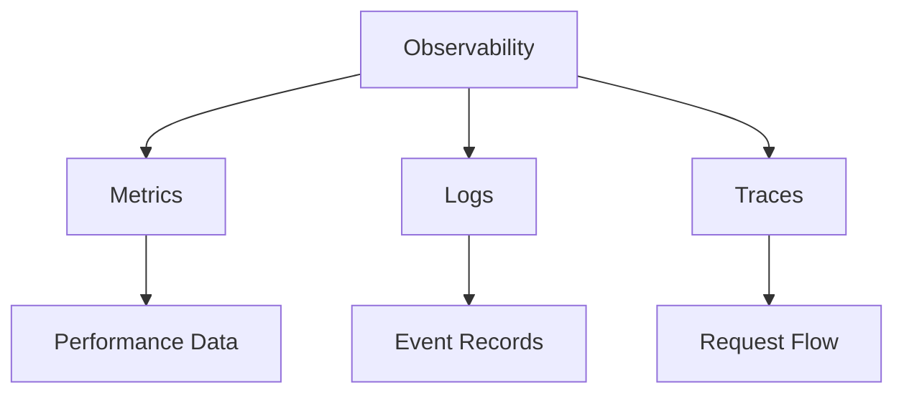

#### 1. Metrics:
- **Quantitative data**: CPU, memory, response times
- **Time-series data**: Trends and patterns
- **Aggregated data**: Averages, percentiles, counts

#### 2. Logs:
- **Event records**: What happened and when
- **Structured logging**: JSON format for parsing
- **Centralized collection**: Single source of truth

#### 3. Traces:
- **Request flow**: Path through distributed systems
- **Performance bottlenecks**: Slow components
- **Error propagation**: How failures spread

### Application Performance Monitoring (APM)

#### Key Metrics to Monitor:

1. **RED Metrics**:
   - **Rate**: Requests per second
   - **Errors**: Error rate percentage
   - **Duration**: Response time distribution

2. **USE Metrics**:
   - **Utilization**: Resource usage percentage
   - **Saturation**: Queue lengths, wait times
   - **Errors**: Error counts and rates

3. **Business Metrics**:
   - User sign-ups
   - Revenue per hour
   - Feature usage

### Alerting Best Practices

#### Alert Levels:
1. **Page**: Immediate human intervention required
2. **Ticket**: Action needed within hours/days
3. **Log**: Informational, no action required

#### Alert Criteria:
- **Actionable**: Clear next steps
- **Relevant**: Affects user experience
- **Timely**: Alerts before impact
- **Unique**: No duplicate alerts

---

## 8. Infrastructure as Code

### What is Infrastructure as Code (IaC)?

**IaC** manages infrastructure through code rather than manual processes.

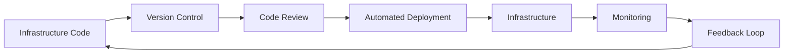

#### Benefits:
- **Consistency**: Identical environments
- **Version Control**: Track infrastructure changes
- **Automation**: Reduce manual errors
- **Documentation**: Code as documentation
- **Disaster Recovery**: Rapid rebuilds

### Our IaC Approach

#### 1. Shell Scripts:
```bash
# setup.sh - Infrastructure provisioning
aws ecr create-repository --repository-name auto-pipe-api
aws ecs create-cluster --cluster-name auto-pipe-cluster
aws logs create-log-group --log-group-name /ecs/auto-pipe-app
```

#### 2. JSON Templates:
```json
// taskdef.template.json - ECS task definition
{
  "family": "auto-pipe-task",
  "requiresCompatibilities": ["FARGATE"],
  "containerDefinitions": [...]
}
```

#### 3. GitHub Actions:
```yaml
# Deployment automation
- name: Deploy to Amazon ECS
  uses: aws-actions/amazon-ecs-deploy-task-definition@v1
  with:
    task-definition: taskdef.json
    service: auto-pipe-service
    cluster: auto-pipe-cluster
```

### Advanced IaC Tools

#### Terraform:
- **Declarative**: Describe desired state
- **Multi-cloud**: AWS, Azure, GCP support
- **State Management**: Track resource state
- **Plan/Apply**: Preview before changes

#### AWS CDK:
- **Programming Languages**: TypeScript, Python, Java
- **AWS Native**: Deep AWS integration
- **Constructs**: Reusable components
- **Type Safety**: Compile-time validation

---

## 9. Interview Questions & Answers

### DevOps Fundamentals

**Q: Explain the difference between CI and CD.**

**A**: CI (Continuous Integration) automatically integrates code changes from multiple developers by running automated builds and tests. CD (Continuous Deployment) extends CI by automatically deploying successful builds to production. CD ensures that code is always in a deployable state and reduces manual deployment errors.

**Q: What are the benefits of containerization?**

**A**: Containerization provides:
- **Consistency**: Same environment from dev to production
- **Portability**: Run anywhere containers are supported
- **Isolation**: Applications don't interfere with each other
- **Efficiency**: Lower overhead than virtual machines
- **Scalability**: Easy horizontal scaling

### AWS Services

**Q: Explain the difference between ECS and EKS.**

**A**: 
- **ECS**: AWS-native container orchestration, simpler to use, proprietary API
- **EKS**: Managed Kubernetes service, more complex, open-source API, better for teams already using Kubernetes

**Q: What is AWS Fargate and when would you use it?**

**A**: Fargate is serverless compute for containers. Use it when:
- You don't want to manage EC2 instances
- You have variable workloads
- You want to focus on applications, not infrastructure
- You need better security isolation

### Security

**Q: Explain OIDC and why it's better than storing AWS keys in GitHub.**

**A**: OIDC (OpenID Connect) allows GitHub Actions to assume AWS roles without storing long-lived credentials. Benefits:
- **No static secrets**: Credentials are temporary
- **Automatic rotation**: New tokens for each workflow
- **Fine-grained access**: Specific permissions per repository
- **Audit trail**: Clear access logging

**Q: What is the principle of least privilege?**

**A**: Give users/services only the minimum permissions needed to perform their tasks. This reduces security risks by limiting potential damage from compromised accounts or applications.

### Monitoring

**Q: What's the difference between monitoring and observability?**

**A**: 
- **Monitoring**: Watching predefined metrics and known failure modes
- **Observability**: Ability to understand system behavior from external outputs, including unknown failure modes

**Q: What are SLIs, SLOs, and SLAs?**

**A**: 
- **SLI** (Service Level Indicator): Specific metrics (e.g., response time)
- **SLO** (Service Level Objective): Target values for SLIs (e.g., 99.9% uptime)
- **SLA** (Service Level Agreement): Contract with consequences for missing SLOs

### Troubleshooting

**Q: How would you troubleshoot a failing ECS service?**

**A**: 
1. Check service events in ECS console
2. Review CloudWatch logs for application errors
3. Verify task definition configuration
4. Check IAM permissions for execution/task roles
5. Validate security group and network settings
6. Review resource limits (CPU/memory)

**Q: Your CI/CD pipeline is failing. What's your debugging approach?**

**A**: 
1. Check the failing step in GitHub Actions logs
2. Reproduce the issue locally if possible
3. Verify environment variables and secrets
4. Check service dependencies and network connectivity
5. Review recent changes that might have caused the issue
6. Validate infrastructure state in AWS console

### Best Practices

**Q: How do you ensure zero-downtime deployments?**

**A**: 
- **Rolling deployments**: Gradually replace old containers
- **Health checks**: Ensure new containers are healthy before routing traffic
- **Load balancer integration**: Automatic traffic routing
- **Rollback strategy**: Quick revert to previous version
- **Database migrations**: Backward-compatible changes

**Q: What's your approach to secrets management?**

**A**: 
- **Never commit secrets to code**
- **Use dedicated secret stores** (AWS Secrets Manager, GitHub Secrets)
- **Inject secrets at runtime** through environment variables
- **Rotate secrets regularly**
- **Audit secret access**
- **Use service accounts** instead of user credentials

---

## Conclusion

Understanding these concepts will make you confident in interviews and capable of explaining every aspect of the Auto-Pipe project. Each concept builds upon the others to create a comprehensive understanding of modern DevOps and cloud engineering practices.

The key to mastering these concepts is:
1. **Understanding the "why"** behind each technology choice
2. **Knowing the trade-offs** between different approaches
3. **Being able to explain** complex concepts in simple terms
4. **Having hands-on experience** with real implementations

You're now equipped with the foundational knowledge to not just implement the project, but to truly understand and explain every component to potential employers!
